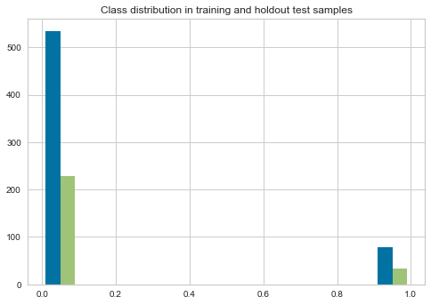

# Classifier overview

This readme presents an overview of the current state of the classifier

## Load data

    Training data size: 613
    Holdout data size: 263

    

    

## Selected model
    

    
    

    

## Cross-validation performance on training data

<table border="1" class="dataframe">
  <thead>
    <tr>
      <th></th>
      <th></th>
      <th colspan="2" halign="left">Value</th>
    </tr>
    <tr>
      <th></th>
      <th></th>
      <th>mean</th>
      <th>std</th>
    </tr>
    <tr>
      <th>Classifier</th>
      <th>Metric</th>
      <th></th>
      <th></th>
    </tr>
  </thead>
  <tbody>
    <tr>
      <th rowspan="8" valign="top">her2-status</th>
      <th>AUC_ROC</th>
      <td>0.933096</td>
      <td>0.034482</td>
    </tr>
    <tr>
      <th>Accuracy</th>
      <td>0.967870</td>
      <td>0.012733</td>
    </tr>
    <tr>
      <th>Balanced accuracy</th>
      <td>0.933096</td>
      <td>0.034482</td>
    </tr>
    <tr>
      <th>F1</th>
      <td>0.929098</td>
      <td>0.026985</td>
    </tr>
    <tr>
      <th>Kappa</th>
      <td>0.858284</td>
      <td>0.053872</td>
    </tr>
    <tr>
      <th>MCC</th>
      <td>0.860123</td>
      <td>0.052695</td>
    </tr>
    <tr>
      <th>Precision</th>
      <td>0.872938</td>
      <td>0.064924</td>
    </tr>
    <tr>
      <th>Recall</th>
      <td>0.886230</td>
      <td>0.069732</td>
    </tr>
  </tbody>
</table>

## Performance on training data without cross-validation

<table border="1" class="dataframe">
  <thead>
    <tr style="text-align: right;">
      <th></th>
      <th>Accuracy</th>
      <th>Precision</th>
      <th>Recall</th>
      <th>F1</th>
      <th>AUC_ROC</th>
      <th>Kappa</th>
      <th>MCC</th>
      <th>Balanced accuracy</th>
    </tr>
  </thead>
  <tbody>
    <tr>
      <th>1</th>
      <td>0.97553</td>
      <td>0.932432</td>
      <td>0.873418</td>
      <td>0.901961</td>
      <td>0.932027</td>
      <td>0.887998</td>
      <td>0.888618</td>
      <td>0.932027</td>
    </tr>
  </tbody>
</table>

    

    

## Test set performance on holdout data

<table border="1" class="dataframe">
  <thead>
    <tr style="text-align: right;">
      <th></th>
      <th>Accuracy</th>
      <th>Precision</th>
      <th>Recall</th>
      <th>F1</th>
      <th>AUC_ROC</th>
      <th>Kappa</th>
      <th>MCC</th>
      <th>Balanced accuracy</th>
    </tr>
  </thead>
  <tbody>
    <tr>
      <th>1</th>
      <td>0.977186</td>
      <td>0.911765</td>
      <td>0.911765</td>
      <td>0.911765</td>
      <td>0.949332</td>
      <td>0.898664</td>
      <td>0.898664</td>
      <td>0.949332</td>
    </tr>
  </tbody>
</table>

    

    

    

    

    

    

